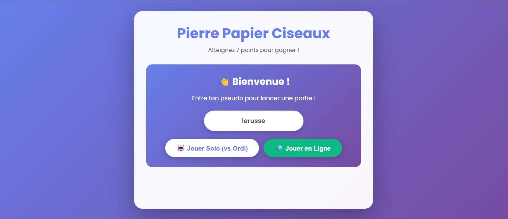

# 🎮 Pierre Papier Ciseaux — Solo & Multijoueur

Un jeu moderne de **Pierre Papier Ciseaux** jouable directement dans le navigateur.

Le projet propose deux modes de jeu :

- 🤖 **Mode Solo** contre l’ordinateur
- 🌍 **Mode Multijoueur en ligne** en temps réel avec un lien d’invitation

Le premier joueur à atteindre le score demandé remporte la partie.

> Projet réalisé avec HTML, CSS, JavaScript et Socket.IO.

---

##  Aperçu



> Ajoute une capture d’écran de ton jeu dans le dossier `images` avec le nom `preview.png`.  
> Si tu n’as pas encore de capture, enlève simplement les trois lignes ci-dessus.

---

##  Fonctionnalités

- Choix d’un pseudo avant de commencer une partie
- Sauvegarde automatique du pseudo avec `localStorage`
- Mode solo contre un ordinateur avec choix aléatoire
- Mode multijoueur en temps réel avec Socket.IO
- Création automatique d’un salon multijoueur
- Lien d’invitation à copier et partager avec un ami
- Affichage du choix de chaque joueur
- Gestion des égalités, victoires et défaites
- Score mis à jour en direct
- Fin de partie avec modal de victoire ou de défaite
- Interface moderne, animée et adaptée aux téléphones
- Design responsive pour ordinateur et smartphone

---

##  Règles du jeu

Les règles sont simples :

| Ton choix | Bat |
|---|---|
| 🪨 Pierre | ✂️ Ciseaux |
| 📄 Papier | 🪨 Pierre |
| ✂️ Ciseaux | 📄 Papier |

- Si les deux joueurs choisissent la même arme : c’est une **égalité**.
- En mode solo, il faut atteindre **7 points** pour gagner.
- En mode multijoueur, le premier joueur à atteindre **3 points** gagne le match.

---

##  Modes de jeu

###  Mode solo

Joue contre l’ordinateur.

- L’ordinateur choisit aléatoirement entre pierre, papier et ciseaux.
- Tu gagnes en atteignant 7 points.
- Si tu perds plusieurs manches sans avoir de points, ton crédit descend.
- À `-7` crédits, la partie est perdue.

###  Mode multijoueur

Affronte un ami en ligne.

1. Entre ton pseudo.
2. Clique sur **Jouer en Ligne**.
3. Un code de salon est généré.
4. Copie le lien d’invitation.
5. Envoie le lien à ton adversaire.
6. Dès qu’il rejoint le salon, le match commence.
7. Le premier joueur à obtenir 3 points gagne.

---

##  Technologies utilisées

| Technologie | Utilisation |
|---|---|
| HTML5 | Structure de l’interface |
| CSS3 | Design, animations et responsive design |
| JavaScript Vanilla | Logique du jeu et interactions |
| Socket.IO | Communication en temps réel en mode multijoueur |
| Node.js | Serveur Socket.IO pour les parties en ligne |
| LocalStorage | Sauvegarde locale du pseudo du joueur |
| Render | Hébergement du serveur multijoueur |

---

##  Structure du projet

```text
pierre-papier-ciseaux/
│
├── index.html
├── style.css
├── script.js
│
├── images/
│   ├── rock.png
│   ├── paper.png
│   ├── scissors.png
│   └── preview.png
│
└── README.md
```

> Pour le multijoueur, le projet utilise également un serveur Node.js avec Socket.IO.

---

## 💻 Installation locale

### 1. Cloner le repository

```bash
git clone [https://github.com/TON-USERNAME/pierre-papier-ciseaux.git](https://github.com/TON-USERNAME/pierre-papier-ciseaux.git)
```

### 2. Entrer dans le dossier du projet

```bash
cd pierre-papier-ciseaux
```

### 3. Lancer le front-end

Tu peux ouvrir directement `index.html` dans ton navigateur.

Pour une meilleure expérience, utilise l’extension **Live Server** dans Visual Studio Code :

1. Ouvre le projet dans VS Code
2. Installe l’extension `Live Server`
3. Clique droit sur `index.html`
4. Clique sur **Open with Live Server**

Le jeu sera généralement disponible ici :

```text
http://127.0.0.1:5500
```

---

##  Configuration du multijoueur

Le fichier `script.js` choisit automatiquement l’adresse du serveur Socket.IO :

```js
const SOCKET_URL = window.location.hostname === "localhost"
    ? "http://localhost:3000"
    : "[https://rps-server-ikzi.onrender.com](https://rps-server-ikzi.onrender.com)";
```

En local, le front-end essaie de se connecter à :

```text
http://localhost:3000
```

En production, il se connecte au serveur déployé sur Render.

Pour que le multijoueur fonctionne en local, démarre aussi le serveur Node.js Socket.IO sur le port `3000`.

---

##  Fonctionnement technique

### Mode solo

À chaque clic sur Pierre, Papier ou Ciseaux :

1. Le joueur choisit une arme.
2. L’ordinateur choisit une arme aléatoirement.
3. Le programme compare les deux choix.
4. Le score ou le crédit est mis à jour.
5. La partie se termine à 7 points ou à -7 crédits.

### Mode multijoueur

1. Le premier joueur crée une salle avec un identifiant aléatoire.
2. Le lien contient le code de la salle : `?room=ABCDE`.
3. Le second joueur ouvre ce lien.
4. Les deux joueurs rejoignent la même salle Socket.IO.
5. Chaque joueur envoie son choix au serveur.
6. Le serveur calcule le résultat de la manche.
7. Les scores sont synchronisés chez les deux joueurs.
8. Le serveur annonce le gagnant dès qu’un joueur atteint 3 points.

---

##  Ajouter une capture d’écran

Pour rendre le repository plus attractif :

1. Ouvre ton jeu dans le navigateur.
2. Fais une capture d’écran.
3. Renomme-la `preview.png`.
4. Place-la dans le dossier :

```text
images/preview.png
```

Elle apparaîtra automatiquement dans la section **Aperçu** du README.

---

##  Améliorations possibles

Voici quelques idées pour faire évoluer le projet :

- Ajouter un classement des meilleurs joueurs
- Ajouter un historique des parties
- Ajouter des sons pour les victoires et défaites
- Ajouter une animation de compte à rebours avant chaque manche
- Ajouter un mode tournoi
- Ajouter une authentification utilisateur
- Ajouter un chat entre les deux joueurs
- Ajouter des tests JavaScript
- Ajouter une base de données pour conserver les scores
- Ajouter GitHub Actions pour vérifier automatiquement le code
- Ajouter une page de statistiques par joueur
- Permettre de jouer à plusieurs manches avec différents objectifs

---

## 🤝 Contribution

Les contributions, idées et retours sont les bienvenus.

Pour contribuer :

```bash
git fork [https://github.com/TON-USERNAME/pierre-papier-ciseaux.git](https://github.com/TON-USERNAME/pierre-papier-ciseaux.git)
```

1. Crée une branche :

```bash
git checkout -b feature/ma-nouvelle-fonctionnalite
```

2. Fais tes modifications.
3. Envoie tes changements :

```bash
git add .
git commit -m "Ajout de ma nouvelle fonctionnalité"
git push origin feature/ma-nouvelle-fonctionnalite
```

4. Ouvre une Pull Request.

---

## 📄 Licence

Ce projet est distribué sous la licence MIT.

Tu peux librement l’utiliser, le modifier et le partager en gardant la mention de l’auteur.

---

## 👨‍💻 Auteur

Développé par **ISTEC Romuald**.

Si ce projet t’a plu, n’hésite pas à lui laisser une étoile ⭐ sur GitHub.